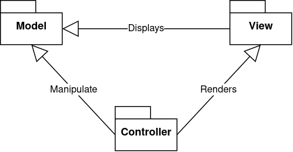

# LDTS_T02_G08 -> SpaceWars

## Game Description

The SpaceWars is a shooter based game where you have to kill different waves of enemies in order to having the chance to save your spaceship and havving a chance to level up your game.
The variety of levels will have increased difficulty with different strategic enemies and firepower of them.

This project was developed by António Campelo(up201704987@up.pt), Edgar Lourenço(up201604910@up.pt) and José Rodrigues(up201809590@up.pt)

## Planned Features

These are the Planned Features to get the game flowing and working properly, some of them are already in place and others are being implemented to the final report.

- **Connected Menus** - The user has the capability of browsing through the different menus including in game ones. (Ex: Main Menu, Instructions, Play, Pause and Quit).
- **Buttons** - Functional and interactive buttons.
- **Mouse and Keyboard control** - The mouse and keyboard inputs are received through the respective events and interpreted according to the current game state.
- **Player control** - The player may move with the keyboard control and shoot his gun when space button is pressed.
- **Collisions detection** - Collisions between different objects are verified. (Ex: Player Fire <->Enemies Fire, Collision between Player<->Enemie and Player <-> Obstacles).
- **Different levels** - 5 different levels with an increasing difficulty were implemented.
- **Animations** - Several animations are incorporated in this game, from enemies exploding to firing actions.

## Architectural Pattern

### Problem in Context

Right from the begin of the development of the game we knew we had to separate in the correct way the different components from our code. In this way, we choose the MVC (Model - View - Controller) structure since it was the most natural for us to apply. In order to do this, we divided our code in three components:

- **Model:** Only represents the data.
- **Controller:** Provides model data to the view and interprets user actions.
- **View:** Displays the model data and sends user actions to the controller.

#### The Pattern

> There are several interpretations of what constitutes a MVC architecture. The most important aspect is that the model represents the data and does nothing else. The model does not depend on the controller or the view. THe controller can either serve as union between the model and the view or just be a connection between user interaction and the model.

#### Implementation

;

#### Consequences

- Increases the modularity of the code.
- More easy to change only one component of the game, while still keeping the others (This code structure respects the Open-Close-Principle)
- Allowed us to implement better testing to the components of the code.
- Improved the organization of the code.

## Design Patterns

### Lanterna's complexity

#### Problem in Context

The GUI framework used for this project has a lot of features that we do not use and that are complex. Our text-based SpaceWars game uses Lanterna and if we were to be using it's methods directly, the code would be more complex than needed, instead, we used a Design Pattern.

#### The Pattern

The pattern used was a facade pattern. A facade provides a simplified interface to a complex framework with a deep set of classes.

#### Implementation

//UML

Classes used for this pattern :
>Game
>GUI
>LanternaGUI

#### Consequences

Using the Facade Pattern allows for the following:

- Simple code from a complex system
- Easier code readability
- Better testability

### Game loop

#### Problem in Context

Our game's loop is always running during the game to draw images, to process input and to update the positions and states of each element. In order for the user input and processor speed to be independent we use a pattern that allows them to not block each other.

#### The Pattern

User input and processor speed are independent.
A game loop is always running during the game, and each iteration the user input is processed without blocking the loop, updates the game and draws it.

#### Implementation

//UML

#### Consequences

- Game doesn't block user input
- Frames are drawn consistently
- Element attributes are updated consistently

### Movement Command Pattern

#### Problem in Context

In order for the movement to be simple and not cause any unecessary complexity, we use the Command Pattern design which allows to encapsulate all information needed to perform an action.

#### The Pattern

The command pattern "is a behavioral design pattern in which an object is used to encapsulate all information needed to perform an action or trigger an event at a later time".

#### Implementation 
	
//UML
Classes used for this pattern :
//

> Input handler
> Direction movement

#### Consequences

- Simplifies user input to execute an action
- Easy to implement middle operations between input and action
- Separation from input and action

### Button Command Pattern

#### Problem in Context

In the implementation of the Menus, their controllers have to interact with the model to change the game state, which causes a problem because they are not responsible to handle game states. So it was used the Command Pattern.

#### The Pattern

The command pattern "is a behavioral design pattern in which an object is used to encapsulate all information needed to perform an action or trigger an event at a later time".

#### Implementation 

//UML
Classes used for this pattern :
//

>Button command

#### Consequences

- View controllers that invoke operations are independent from the objects that perform them.
- Easy to add new buttons to a view with the encapsulation inside them.