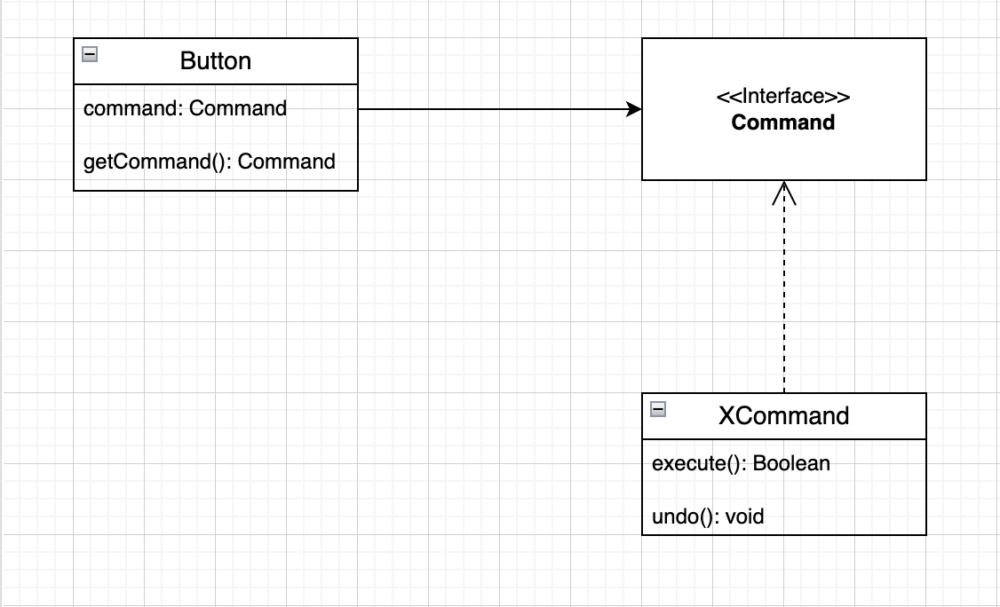

# LDTS_T02_G08 -> SpaceWars

## Game Description

The SpaceWars is a shooter based game where you have to kill different waves of enemies in order to having the chance to save your spaceship and havving a chance to level up your game.
The variety of levels will have increased difficulty with different strategic enemies and firepower of them.

This project was developed by António Campelo(up201704987@up.pt), Edgar Lourenço(up201604910@up.pt) and José Rodrigues(up201809590@up.pt)

## Implemented Features

- **Connected Menus** - The user has the capability of browsing through the different menus including in game ones. (Ex: Main Menu, Play, Pause and Quit).
- **Buttons** - Functional and interactive buttons.
- **Mouse and Keyboard control** - The mouse and keyboard inputs are received through the respective events and interpreted according to the current game state.
- **Player control** - The player may move with the keyboard control and shoot his gun when space button is pressed.
- **Collisions detection** - Collisions between different objects are verified. (Ex: Player Fire <->Enemies Fire, Player <-> Playground Limits).
- **Different levels** - 5 different levels with an increasing difficulty were implemented.
- **Animations** - Several animations are incorporated in this game, from levels to firing actions.

## Planned Features

All the planned features were successfully implemented without major dificulties.

## Design

### General Structure

#### Problem in Context

The first problem that our group has interested in solve is how the game would be structured. Since our game is dealing with a GUI and has many different states in game, we have some pattern that came to mind to fill that need in the best way.

#### The Pattern

Two main pattern were applied to the project, the **State Pattern** and the **Architetural Pattern**, the first is the behaviour design pattern that lets and object change its behaviour when has internal state changes. The second Pattern is the Model-View-Controller style which is commonly used in a GUI to make a game.

#### Implementation

About the implementation, we have classes which main purpose is to store data(Model), classes that have control of the logic of the game (Controller) and classes that are responsible for the visual effects on the screen(View), these types of classes associate with each other in the following way:

*Fig 1 -> Model-View-Controller*

With the different states of the game, all of them follow the Model-View-Controller style and allow the SpaceWars to modify its behaviour in a simple and effective way.

#### Consequences

- The several states in the game that manage different menus become explicit in the code despite of relying on flags to control
- Easy to add new features in the development stage
- A well organized code acknowledging the Single Responsibility Principle.

### Listeners and Observers

#### Problem in Context

Spacewars is controlled both by the mouse, which controls the menus, and the keyboard, that controls the spaceship and fires, for that many are the ways to receive input from these devices, in example: a thread that is running and every time it catches a signal it sends to the game itself (polling), the game being responsible for asking for input when needed, which is costly for our program since we may not send any signal to the program and unnecessary calls are made or the way we decided to implement which consists of using observers also known as listeners that are responsible for receiving the said input and redistributing it in a nicer and more usefull way to us. This takes some "weight" of the program as it will no longer need to be polling for input, as it will be properly warned when received.

#### The Pattern

We applied in SpaceWars the **Observer Pattern** which is a behaviour design pattern that lets define a mechanism to notify multiple objects about any events that happen to the object they are observing. This pattern allowed us to solve the identified problems and apply a mechanism to receive the game input.

#### Implementation

In SpaceWars, we store the observers in the main class(Game Class) and change the state according to the input processed by the available listener. All listeners were always active, since when creating a MenuButton, the listener would be activate by the new created state.

*Fig 2 -> Observers Listeners*

#### Consequences

- Clean Code
- Only the current game state is avised when input is given
- Promotes the single responsibility principle.

### Level Builder 

#### Problem in Context

A level in SpaceWars consists in an junction of a player(SpaceShip) and a number of enemies, differente from level to level, instead of building level by level, we have a Level Loader that consists in read from a file and inserts into the Builder, that we called LevelBuilder the needed elements to construct the level. This implementation makes it possible to create only the specific elements to the level and generate only the level that the user is.

#### The Pattern

The **Factory Method** and **Builder** are two creational design patterns, the first one provides an interface for creating objects in a superclass, but allows subclasses to alter the type of objects that will be created. The second, allows you to construct complex objects step by step making a simpler code.

#### Implementation

A factory is resposible for constructing the whole but the workers are the ones that actually execute the job. In this case the LevelBuilder is the factory and its subclasses represent the workers. In the implementation, the LevelBuilder is an abstract class which knows how to construct a level, however only its subclasses supply the necessary components of the level. The LevelLoader is one of the subclasses that consists in a worker capable of reading different levels from different files. The level pattern is implemented in all of the classes show in the figure 3.

*Fig 3 -> Level Builder and Loader*

#### Consequences

- Open/Closed Principals. Can introduce new types of enemies without breaking existing client code.
- Avoid tight coupling between the creator and the products.
- Can construct level step by step, defer run steps recursively.

### Types of Command

#### Problem in Context

The diversity between buttons was not significant for the objective of the game. In the course of the building of the project, the numbers of buttons had to be generalise. That said and kwoning that a good design of software is often based on the principle of separation of concerns.

#### The Pattern

In SpaceWars we applied the **Command** also kwonw as Action Pattern.This pattern turns a request into a stand-alone object that contains all information about the request.

#### Implementation

All the Button Classes are in a single Button with a command attribute. These commands implement the same interface having an execution method that takes no parameters. This interface lets you use various commands with the same request, without coupling it to concrete commands. With that, you can switch command objects linked to the sender, effectively changing the sender's behaviour.

*Fig 4 -> Button - Command *

